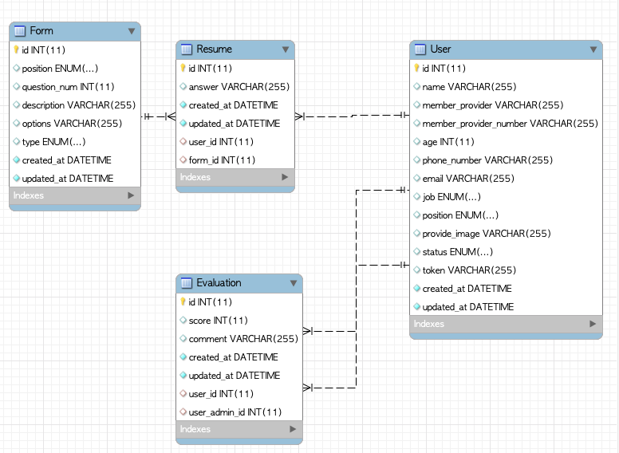

# CREW SERVER

- [김세준](https://github.com/Kimsejune)
- [김현규](https://github.com/hyungyu-harrykim)
- [김현준](https://github.com/4whomtbts)

# 사용 기술

**1) Server**
- Node.js
- Express
- TypeScript  
- AWS (supported: EC2, S3(Image Storage), Caddy): Cloud Web Server

   

**2) Database**
- MYSQL
- KNEX (node-mysql connector)
- Express  
   

**3) Package Manager**
- npm
   

**4) API Doc**
- Swagger  
        - /api-docs 에서 확인할 수 있다.  

## Team Work
- Git (소스 코드 버전 관리)
- Zeplin (디자인 시안 공유)
- 매주 목 HangOut 온라인 회의: 데일리 스크럼
- 매주 목 오프라인 정기 회의: 이슈 공유 및 논의, 코드 리뷰

# DB_ERD

# API SPECIFICATION

## 가. auth/ 

 기능 : 사용자 인증을 확인하거나 발급한다.

### ㄱ. get : auth/ 
- header token 전송.

                현재 사용자의 인증정보를 렌더링해준다
           auth/google 
                구글인증을 요청한다
           auth/google/callback 
                구글 인증에 대한 콜백을 받는다
           auth/facebook 
                페이스북인증을 요청한다
           auth/facebook/callback 
                페이스북 인증에 대한 콜백을 받는다
           auth/kakao 
                카카오 인증을 요청한다
           auth/kakao/callback 
                카카오  인증에 대한 콜백을 받는다      

        
### [ DETAILS ] 

####  공통 GET METHOD : 

         성공 시:
                /auth 로 redirect 한다.
         실패 시: 
                각자 SERVICE 회사에서 정의한 방식의 오류를 

 
## 나. resumes/ 

 기능 : 지원서를 작성하고 읽어온다

#### ㄱ. get : 

           resumes/ 
                자신의 지원서를 읽는다
           resumes/read?user_id=유저아이디
                관리자 권한이 있는 사용자가 query 에 명시한 유저의 지원서를 조회한다.

#### ㄴ. post : 

            resumes/            
                지원자가 자신의 지원서를 서버에 제출한다.

                     
### [ DETAILS ] 

#### GET METHOD : 

        A. resumes/ 

         1. 입력데이터 : X , user_id = req.user.id
                
         2. 예상되는 결과값         

                성공 시 : 자신의 지원서를 반환한다
                실패 시 : 오류사유를 반환한다

   
         B. resumes/read   ** 관리자권한 ** 

         1. 입력데이터 : QUERY , user_id , user_id = req.query.user_id ,  admin_id = req.user.id        
         2. 예상되는 결과값

                성공 시 : QUERY 에 명시 된 유저의 지원서를 반환한다
                실패 시 : 오류사유를 반환한다
         
#### POST  METHOD : 
- req.body.form_id, req.body.answer
        
        A. resumes/ 

         1. 입력데이터 : 
                 // 예시질문 :  좋아하는 프레임워크는 ?(Short_Answer)
                {
                        form_id : 폼아이디
                        answer : "spring 프레임워크"
                }

                // 예시질문 : 개발경력을 골라주세요(Selector)

                {
                        form_id : 폼아이디
                        answer : "1년미만"
                }  
                

## 다. evaluation/ 
 기능 : 지원자들에 대한 운영진들의 평가를 작성하고 읽어온다.
 
 
* get 과 put 모두 Admin 권한이 요구된다.
* score 는 반드시 0보다 크거나 같으며  100보다 작거나 같다.
* score 는 반드시 숫자이다

#### ㄱ. get:  

          evaluation/read?user_id=유저번호
                관리자 권한으로 해당되는 user_id 의 모든 평가를 읽는다.

#### ㄴ. put : 
          
           evaluation?user_id=유저번호
                관리자 권한으로 해당되는 user_id 쿼리에 명시된 유저의 현재 인증된 admin 의 평가를 생성/수정한다 

###[ DETAILS ]

#### GET METHOD : ** 관리자 권한 ** 
          

1. 입력데이터
        evaluation?user_id=유저번호

2. 예상되는 결과값
    2-1. 성공시 
            해당 유저에 대한 모든 ADMIN 의 평가를 반환한다
    2-2. 실패시
            오류사유를 반환한다        

성공결과 : 

        [
        {
                "id": 782,
                "score": 3229,
                "comment": "excellent",
                "created_at": "2019-02-21T04:59:47.000Z",
                "updated_at": "2019-02-21T05:28:06.000Z",
                "user_id": 4,
                "user_admin_id": 4
        } 
        ]

#### PUT METHOD :  ** 관리자 권한 **  
- req.query.user_id, req.body.score, req.body.comment

1. 입력데이터

        evaluation?user_id=유저번호

        {
                "score": 90,
                "comment" : "훌륭합니다"
        }

2. 예상되는 결과값
    2-1. 성공시 
            TRUE 를 반환한다                
    2-2. 실패시
            오류사유를 반환한다        

## 라. form : 지원양식을 작성하고 읽어온다.

- DESCRIPTION
 
 * question_num 은 0부터 시작하며 음수값은 불가능하다
 * put 과 delete 는 Admin 권한이 요구된다.
 * position 은 Developer, Designer 로 명시한다.
 * 입력데이터 JSON 의 최상위 부모는 form 이다.
 
 ㄱ. get : forms?position=직군명 ( Developer 혹은 Designer )
         position 쿼리에 명시된 position 의 모든 form data 를 읽는다
 ㄴ. post : forms
         body 에 입력하여 서버에 데이터를 보내 생성/업데이트 한다.
 ㄷ. delte : forms/:id
         form_id를 가져와서 form을 삭제한다.

### [ DETAILS ]

#### GET METHOD : 

1. 입력데이터 :  form?position=Designer 

2. 예상되는 결과값

   2-1. 성공시 
         
            해당하는 POSITION 의 FORM 데이터를 반환한다

 
   2-2. 실패시

            오류사유를 반환한다         
   

#### POST METHOD :  ** 관리자 권한 ** 

 1. 입력데이터
- req.body.question_num, req.body.position, req.body.options, req.body.description

#### 1-1. 개발자 폼 양식예시 

        {
                "form" : [
                        {
                "question_num" : 0,
                "position" : "Developer",
                "options" : ["하나","둘"],
                "type" : "Selector",
                        "description" :  "개발자 테스트"
                        },
                                {
                "question_num" : 1,
                "position" : "Developer",
                "type" : "Short_Answer",
                        "description" :  "좋아하는 프레임워크는???"
                        },
                "question_num" : 2,
                "position" : "Developer",
                "type" : "Long_Answer",
                        "description" :  "좋아하는 프레임워크는???"
                        }
                        ]
        }               

####  1-2. 디자이너 폼 양식예시 

        {
                "form" : [
                        {
                "question_num" : 1,
                "position" : "Designer",
                "type" : "Short_answer",
                        "description" :  "좋아하는 커피를 적어주세요"
                        },
                                {
                "question_num" : 2,
                "position" : "Designer",
                "options" : ["1년미만","50년이상"],
                "type" : "Long_Answer",
                        "description" :  "제플린 사용 경력은??"
                        },
        {
                "question_num" : 3,
                "position" : "Designer",
                "type" : "Upload",
                        "description" :  "포트폴리오를 업로드 해주세요"
                        }
                        ]
        }

2. 예상되는 결과값

    2-1. 성공시 

          TRUE 를 반환한다

    2-2. 실패시

            오류사유를 반환한다        

#### DELETE METHOD :  ** 관리자권한 ** 

1.   forms/:id
- req.params.id = form_id

2. 예상되는 결과값 

   2-1. 성공시 

            TRUE 를 반환한다

    2-2. 실패시

            오류사유를 반환한다    
               

## 마. mail : mail을 전송한다.

#### POST METHOD :  ** 관리자권한 ** 

1. mail/

        {
                "mail_title": "hello",
                "mailList": [
                        {
                                "mail": "tpwns1088@gmail.com",
                                "name": "kimsejune"
                        }
                ],
                "mail_context": "님 안녕하세요"
                
        }